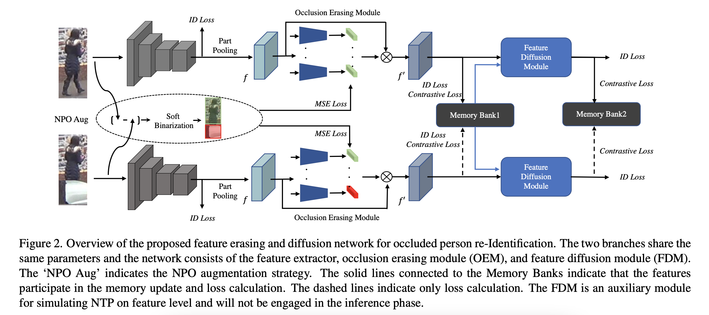
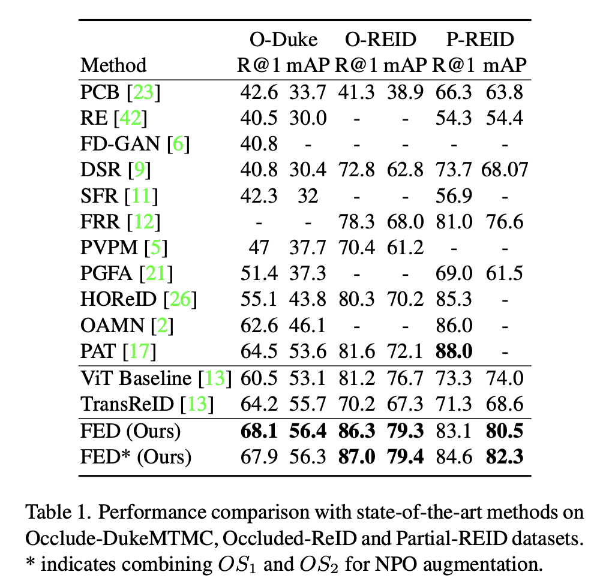
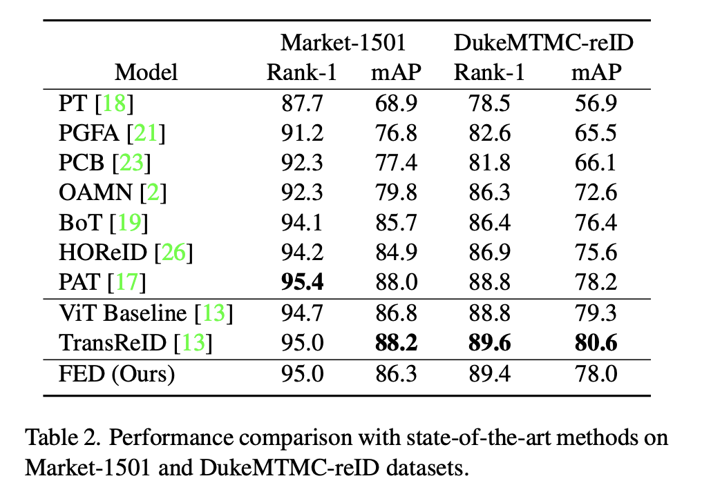
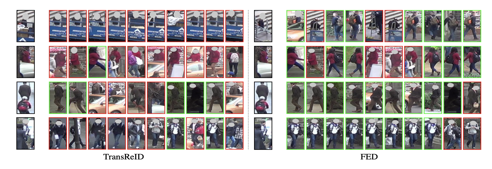

# FED-Occluded-ReID
FED: Official Pytorch implementation of [Feature Erasing and Diffusion Network for Occluded Person Re-Identification (CVPR2022)](https://openaccess.thecvf.com/content/CVPR2022/papers/Wang_Feature_Erasing_and_Diffusion_Network_for_Occluded_Person_Re-Identification_CVPR_2022_paper.pdf)

## Pipline

  
 

 
 ## Experiment Results on Holistic and Occluded Person ReID Datasets
 

  
 

 
 

  
 

 
 ## Retrieve Comparison between [TransReID](https://github.com/damo-cv/TransReID) 
 

  
 

 
 
 ## Requirements
 ### Installation
 Please refer to [TransReID](https://github.com/damo-cv/TransReID) 
 ### Dataset Preparation
 

